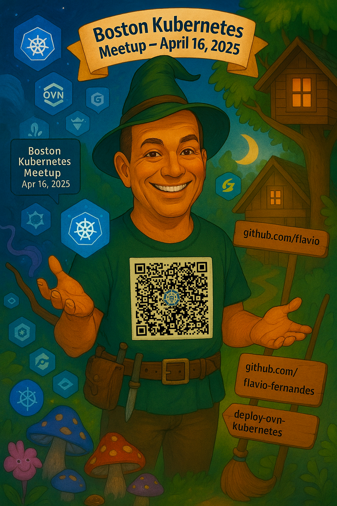

# Boston Kubernetes Meetup: OVN Kubernetes

[K8s Optimization + OVN Kubernetes + Remote Dev](https://www.meetup.com/boston-kubernetes-meetup/events/306905227/)


## Hands-on Journey Through Kubernetes Networking: From Basic CNI to OVN-Kubernetes

Based on the KubeCon EU 2024 Tutorial:
[From CNI Zero to CNI Hero: A Kubernetes Networking Tutorial](https://kccnceu2024.sched.com/event/1YeQ4/tutorial-from-cni-zero-to-cni-hero-a-kubernetes-networking-tutorial-using-cni-doug-smith-tomofumi-hayashi-red-hat)

And DevConf.CZ 2023 Talk:
[OVN-Kubernetes: The new default CNI of OpenShift](https://sched.co/1MYfy)

---

## About Me



A CNI plumber at NVIDIA, leveraging OVN to make packets go wire speed to gamers worldwide.

"Learn the field, not the subject" -- [Jesse Heines](https://www.linkedin.com/in/jesse-heines-1413a02/)

[Engineer as a service](https://www.flaviof.com/blog2/post/main/engineer-as-a-service/)

---

## CNI Fundamentals
Quick overview of Container Network Interface basics using material from:
- [KubeCon EU 2024 Tutorial Slides](KubeCon-EU2024-CNI.pdf)
- Key concepts:
  - What is CNI?
  - CNI Plugin Types
  - CNI Specification
  - Basic Network Configuration

---

## Demo Overview

We'll explore Kubernetes networking through three progressive demos:

### Demo 1.1: Basic CNI Implementation
- Creating a Kind cluster
- Understanding CNI basics
- Implementing a dummy CNI plugin
- Hands-on with CNI configuration

### Demo 1.2: Flannel CNI
- Building upon our basic cluster
- Implementing Flannel
- Basic pod networking

### Demo 2: Advanced Networking with OVN-Kubernetes
- Multi-worker Kind cluster setup
- Implementing Multus CNI
- Deploying OVN-Kubernetes
- Creating pods with multiple interfaces
- Understanding overlay networks
- Observing pod-to-pod communication

---

## Demo Recordings

### Demo 1.1: Basic CNI Implementation
This demo shows the fundamental building blocks of CNI by creating a Kind cluster and implementing a simple dummy CNI plugin. We'll see how CNI plugins interact with the container runtime and how basic network configuration is applied to pods.

[](https://asciinema.org/a/715446)

### Demo 1.2: Flannel CNI
Building upon our basic cluster, this demo demonstrates how to implement Flannel CNI.

[](https://asciinema.org/a/715450)

### Demo 2: Advanced Networking with OVN-Kubernetes
This demo builds upon the excellent presentation by Surya and Patrik at DevConf.CZ 2023. We'll explore OVN-Kubernetes as the CNI, showcasing its capabilities with Multus CNI to create pods with multiple network interfaces.

[](https://asciinema.org/a/715722)

---

## OVN Database Monitoring

A handy tool for monitoring OVN databases managed by OVN-Kubernetes:

```bash
# Install ovsdb-mon
git clone https://github.com/flavio-fernandes/ovsdb-mon && \
    cd ovsdb-mon/dist && . ./ovsdb-mon-ovn.source

# Monitor main ovn northbound tables
ovsdb-mon.nb -auto -no-monitor nb_global,connection

# Cleanup
kubectl delete ns ovsdb-mon
```

---

## Resources
- [OVN-Kubernetes Project](https://ovn-kubernetes.io/)
- [Deploy kind with OVN-Kubernetes CNI](https://github.com/flavio-fernandes/ovscon22kind/blob/main/docs/workshop.md)
- [ovsdb-mon](https://youtu.be/kw59O7hIpME?si=wfuzAiZKLfV1q2jL): OVS database Monitoring Tool

- [CNI Hero Tutorial Video](https://youtu.be/YumoKGhuZ2o)
- [CNI Hero Tutorial Slides](https://static.sched.com/hosted_files/kccnceu2024/91/KubeCon%20EU2024%20CNI%20tutorials_20240321.pdf)
- [CNI Hero Tutorial Repo](https://github.com/dougbtv/cni-hero-hands-on)
- [DevConf.CZ 2023 OVN-Kubernetes Video](https://youtu.be/_1mULoOtTwA?si=gwwCa1XcE3GBw3qr&t=374)
- [DevConf.CZ 2023 OVN-Kubernetes Slides](https://static.sched.com/hosted_files/devconfcz2023/d4/DevConf%202023_%20OVN-Kubernetes_%20The%20new%20default%20CNI%20of%20OpenShift.pdf)

### KubeCon North America 2024, Salt Lake City
- [Thousands of Gamers, One Kubernetes Network](https://kccncna2024.sched.com/event/1i7rA/thousands-of-gamers-one-kubernetes-network-surya-seetharaman-red-hat-girish-moodalbail-nvidia-inc?iframe=yes&w=100%&sidebar=yes&bg=no)

### KubeCon Europe 2025, London
- [Demo of LiveMigration with UDN + Kubevirt + OVN-K8s CNI](https://kccnceu2025.sched.com/event/1tx6n/tutorial-mind-your-pods-business-network-isolation-workshop-surya-seetharaman-miguel-duarte-barroso-red-hat-keith-burdis-goldman-sachs)
- [Project pavilion DEMO](https://kccnceu2025.sched.com/event/1yJU8/cncf-project-demo-kubevirt-with-ovn-kubernetes-cni)
- [CNI DRA coming to Networking](https://kccnceu2025.sched.com/event/1txAx/uncharted-waters-dynamic-resource-allocation-for-networking-miguel-duarte-barroso-red-hat-lionel-jouin-ericsson-software-technology)
